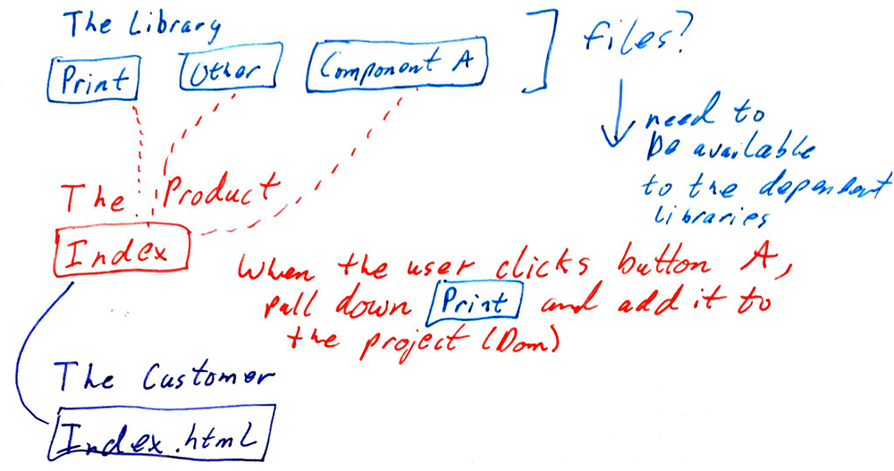

## Dependency Test (The Product)

NOTE: This branch is abandoned.
----

This is a simple project attempting to be a library that depends on another library that then has split files via webpack.

Ideally it would load the js files only when asked for or load the files as a prefetch.  Note: The Customer isn't yet built.

Assumptions:

1. The code in The Library need to be split into separate files since they are being minified and transformed for ES6 (babel).
2. The Product will need access to these separate files so it can load them independently when needed (say with a prefetch or from user interaction).
3. The Product will also be minified and transformed for ES6 but can be separate files per the code splitting.  I'm imaginging at least 2 files for this test:
    * `index.js` - The Product js file that `import(`s The Library
    * `lib/index.js` - The base of The Library file (used for grabbing files from an interaction)
    * `lib/print.js` - One of The Library files that was a result of the split

Questions that remain:

1. If I split the code in The Library how do I get the multiple files pushed into this project?  Is there a webpack plugin (like copy) that can look at the "files" attribute of a specific package.json?
2. Should I not split The Library and only split here?  Would webpack be able to split up the minified Library code?

Here's a sketch:

